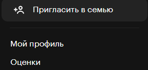
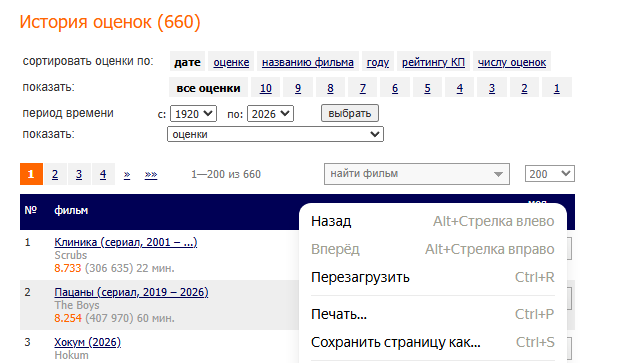
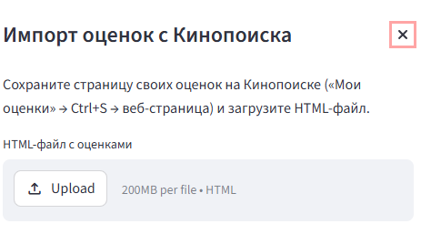

# Гибридная рекомендательная система для онлайн-кинотеатра

Проект представляет собой прототип рекомендательной системы фильмов.
Система объединяет два подхода:

* **контентную фильтрацию** на основе признаков фильмов и метода ближайших соседей;
* **коллаборативную фильтрацию** на основе матричной факторизации ALS.

Готовая модель используется в веб-интерфейсе на Streamlit, где пользователь может получать рекомендации, смотреть историю оценок, работать с каталогом фильмов и переобучать ALS-модель после добавления новых оценок.

## Структура проекта

```text
project/
│
├── data_processing_training/
│   ├── data/
│   ├── models/
│   ├── movies.ipynb
│   ├── users.ipynb
│   └── hybrid.ipynb
│
└── web_app/
    ├── app.py
    ├── model.py
    └── data/
```

## Ноутбуки

### `movies.ipynb`

Ноутбук отвечает за подготовку каталога фильмов.

Основные задачи:

* сбор данных о фильмах;
* очистка каталога;
* обработка пропусков и выбросов;
* преобразование жанров в бинарные признаки;
* масштабирование числовых признаков;
* формирование признаковой матрицы фильмов;
* обучение KNN-модели для контентной фильтрации;
* сохранение подготовленных данных и моделей.

Результатом работы ноутбука являются файлы каталога, признаковой матрицы, KNN-модели и параметры предобработки.

### `users.ipynb`

Ноутбук отвечает за подготовку пользовательских оценок и обучение коллаборативной модели.

Основные задачи:

* генерация пользовательских оценок;
* формирование таблицы оценок пользователь–фильм;
* построение разреженной матрицы взаимодействий;
* обучение ALS-модели;
* сохранение ALS-модели и словарей соответствия пользователей и фильмов.

Результатом работы ноутбука являются обученная ALS-модель и служебные файлы для сопоставления идентификаторов пользователей и фильмов с внутренними индексами модели.

### `hybrid.ipynb`

Ноутбук отвечает за проверку качества и подбор веса гибридной модели.

Основные задачи:

* разделение оценок на обучающую и проверочную части;
* расчёт прогнозов контентной и коллаборативной моделей;
* подбор весового коэффициента `alpha`;
* сравнение качества KNN, ALS и гибридной модели;
* расчёт метрики MAE;
* сохранение лучшего значения `alpha`.

Результатом работы ноутбука является файл `best_alpha.pkl`, который используется веб-приложением для объединения прогнозов двух моделей.

## Python-файлы

### `model.py`

Файл содержит основную логику рекомендательной системы.

Основные функции:

* загрузка сохранённых моделей и данных;
* расчёт прогноза ALS;
* расчёт контентного прогноза KNN;
* формирование гибридных рекомендаций;
* обработка режима холодного старта;
* поиск похожих пользователей;
* переобучение ALS-модели;
* хранение текущей и архивных версий ALS;
* сопоставление оценок пользователя с каталогом фильмов.

Этот файл используется как backend-часть приложения. Он не отвечает за интерфейс, а выполняет расчёты и работу с моделями.

### `app.py`

Файл содержит веб-интерфейс приложения на Streamlit.

Основные возможности интерфейса:

* выбор пользователя;
* получение персональных рекомендаций;
* просмотр истории оценок;
* просмотр каталога фильмов;
* добавление и изменение оценок;
* создание нового пользователя;
* переобучение ALS-модели;
* переключение между текущей и архивными версиями модели.

`app.py` использует функции из `model.py` и отображает результаты работы модели пользователю.

## Сохранённые модели и служебные файлы

В папке `models/` хранятся обученные модели и вспомогательные файлы:

```text
als_model.pkl
best_alpha.pkl
feature_matrix.pkl
knn_model.pkl
movie_ids.pkl
movie_to_idx.pkl
user_ids.pkl
user_to_idx.pkl
```

Эти файлы нужны для запуска рекомендаций.

Также могут храниться файлы предобработки:

```text
length_scaler.pkl
mlb.pkl
rating_scaler.pkl
votes_scaler.pkl
year_scaler.pkl
```

Они нужны для воспроизводимой обработки признаков фильмов и повторной подготовки данных.

## Назначение кода

Код проекта реализует полный цикл работы рекомендательной системы:

1. сбор и очистка каталога фильмов;
2. подготовка признаков фильмов;
3. обучение контентной модели KNN;
4. подготовка пользовательских оценок;
5. обучение коллаборативной модели ALS;
6. подбор коэффициента гибридизации;
7. запуск веб-интерфейса;
8. выдача рекомендаций пользователю.

Система может работать в двух основных режимах:

* **гибридный режим** — если пользователь уже есть в ALS-модели;
* **cold start** — если пользователь новый и ещё не участвовал в обучении ALS.

В режиме cold start рекомендации строятся через контентную фильтрацию KNN.

## Как запустить веб-интерфейс

Перед запуском веб-приложения должны быть подготовлены данные и сохранены модели.

Рекомендуемый порядок:

1. выполнить `movies.ipynb`;
2. выполнить `users.ipynb`;
3. выполнить `hybrid.ipynb`;
4. запустить веб-приложение.

### Установка зависимостей

Создать виртуальное окружение:

```bash
python -m venv .venv
```

Активировать окружение на Windows:

```bash
.venv\Scripts\activate
```

Установить зависимости:

```bash
pip install -r req.txt
```

### Запуск приложения

Из корневой папки проекта выполнить команду:

```bash
streamlit run web_app/app.py
```

После запуска Streamlit выведет локальный адрес приложения, например:

```text
http://localhost:8501
```

Этот адрес нужно открыть в браузере.

## Общий порядок работы

```text
movies.ipynb  →  подготовка каталога и KNN
users.ipynb   →  генерация оценок и обучение ALS
hybrid.ipynb  →  подбор alpha и оценка MAE
model.py      →  логика рекомендаций

## Как импортировать оценки пользователя

В веб-интерфейсе предусмотрен импорт пользовательских оценок с Кинопоиска.
Импорт нужен для того, чтобы создать нового пользователя в системе и построить рекомендации на основе его реальных оценок.

### 1. Открыть раздел с оценками на Кинопоиске

Сначала нужно открыть профиль пользователя на Кинопоиске и перейти в раздел:

```text
Мой профиль → Оценки
```



### 2. Сохранить страницу с оценками

На странице истории оценок нужно убедиться, что отображается список оценённых фильмов.



После этого страницу нужно сохранить как HTML-файл:

```text
Ctrl + S → Веб-страница
```

В результате должен получиться файл формата `.html`, например:

```text
Профиль_ А Е - Оценки.html
```

### 3. Открыть импорт в веб-интерфейсе

После запуска Streamlit-приложения в боковой панели нужно найти блок:

```text
Импорт оценок
```

Затем нажать кнопку:

```text
Загрузить оценки с Кинопоиска
```


### 4. Загрузить HTML-файл

В открывшемся окне нужно выбрать сохранённый HTML-файл с оценками.



После загрузки система:

* распознаёт оценки из HTML-страницы;
* сопоставляет фильмы с внутренним каталогом по идентификатору Кинопоиска;
* создаёт нового пользователя;
* добавляет найденные оценки в таблицу пользовательских оценок.

После импорта в интерфейсе будет показан ID созданного пользователя.
Этот ID нужно выбрать в боковой панели, чтобы получить рекомендации.

### Важное замечание

Если пользователь только что импортирован, он ещё не входит в обученную ALS-модель.
Поэтому сначала рекомендации для него строятся в режиме `cold start`, то есть через контентную фильтрацию KNN.

Чтобы пользователь начал получать гибридные рекомендации, нужно нажать кнопку:

```text
Переобучить ALS
```

После переобучения пользователь будет добавлен в коллаборативную модель.

app.py        →  веб-интерфейс
```
