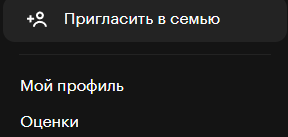
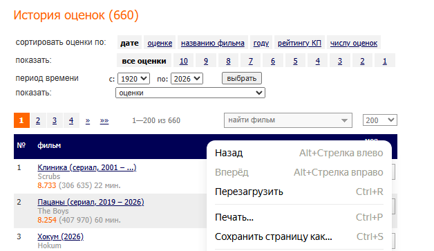

# Гибридная рекомендательная система для онлайн-кинотеатра

Проект представляет собой прототип рекомендательной системы фильмов.
Система объединяет два подхода:

* **контентную фильтрацию** на основе признаков фильмов и метода ближайших соседей;
* **коллаборативную фильтрацию** на основе матричной факторизации ALS.

ALS-прогноз дополнительно калибруется с помощью линейной регрессии, которая переводит сырой скор ALS в шкалу пользовательских оценок.

Готовая модель используется в веб-интерфейсе на Streamlit, где пользователь может получать рекомендации, смотреть историю оценок, работать с каталогом фильмов, импортировать оценки с Кинопоиска и переобучать ALS-модель после добавления новых оценок.

Динамические данные системы (каталог фильмов, жанры, пользователи и их оценки) хранятся в реляционной базе данных SQLite, доступ к которой организован через SQLAlchemy. Бинарные артефакты обучения (ALS-модель, KNN-модель, признаковая матрица, калибратор) остаются в файлах.

## Структура проекта

```text
project/ 
│
├── data_processing_training/
│   ├── data/
│   ├── models/
│   │   ├── current/
│   │   └── archive/
│   ├── pictures/
│   ├── movies.ipynb
│   ├── users.ipynb
│   └── hybrid.ipynb
│
├── docs/
│   └── images/
│
└── web/
    ├── app.py
    ├── model.py
    ├── db.py
    └── data/
        └── ratings.db
```

## Ноутбуки

### `movies.ipynb`

Ноутбук отвечает за подготовку каталога фильмов.

Основные задачи:

* сбор данных о фильмах;
* очистка каталога;
* обработка пропусков и выбросов;
* преобразование жанров в бинарные признаки;
* масштабирование числовых признаков;
* формирование признаковой матрицы фильмов;
* обучение KNN-модели для контентной фильтрации;
* сохранение подготовленных данных и моделей.

Результатом работы ноутбука являются файлы каталога, признаковой матрицы, KNN-модели и параметры предобработки.

### `users.ipynb`

Ноутбук отвечает за подготовку пользовательских оценок и обучение коллаборативной модели.

Основные задачи:

* генерация пользовательских оценок;
* формирование таблицы оценок пользователь–фильм;
* построение разреженной матрицы взаимодействий;
* обучение ALS-модели;
* подготовка служебных словарей пользователей и фильмов;
* обучение калибратора ALS-прогнозов с помощью линейной регрессии;
* сохранение ALS-модели, калибратора и служебных файлов.

Результатом работы ноутбука являются обученная ALS-модель, калибратор `als_calibrator.pkl` и служебные файлы для сопоставления идентификаторов пользователей и фильмов с внутренними индексами модели.

### `hybrid.ipynb`

Ноутбук отвечает за оценку качества KNN, ALS и гибридной рекомендательной модели.

Основные задачи:

* загрузка обучающей и тестовой выборок оценок;
* загрузка KNN-модели, ALS-модели и ALS-калибратора;
* расчёт ALS-прогнозов с применением линейной регрессии;
* расчёт контентных KNN-прогнозов;
* расчёт гибридного прогноза по формуле `alpha * ALS + (1 - alpha) * KNN`;
* перебор значений `alpha` от `0.0` до `1.0` с шагом `0.05`;
* расчёт ranking-метрик `Precision@K`, `Recall@K`, `NDCG@K` и `MAP@K`;
* расчёт MAE для оценки ошибки предсказания рейтингов;
* сравнение качества KNN, ALS и гибридной модели при `K = 5` и `K = 10`;
* выбор итогового значения `alpha` по максимальному `NDCG@10`;
* сохранение лучшего значения `alpha` в файл `best_alpha.pkl`;
* сохранение графиков качества в папку `pictures/`.

Результатом работы ноутбука является файл `best_alpha.pkl`, который используется веб-приложением для объединения ALS- и KNN-прогнозов.

Важно: MAE используется как метрика ошибки предсказания рейтингов, но финальный коэффициент `alpha` выбирается по `NDCG@10`, так как эта метрика оценивает качество ранжирования рекомендаций.

## Метрики качества

В проекте используются два типа оценки качества.

### Ошибка предсказания рейтингов

Для оценки точности предсказания пользовательских оценок используется метрика:

* `MAE` — средняя абсолютная ошибка между реальной оценкой пользователя и предсказанной оценкой модели.

### Ranking-метрики

Для оценки качества топ-N рекомендаций используются ranking-метрики:

* `Precision@K` — доля релевантных фильмов среди первых K рекомендаций;
* `Recall@K` — доля найденных релевантных фильмов среди всех релевантных фильмов пользователя;
* `NDCG@K` — качество порядка рекомендаций с учётом позиции релевантных фильмов;
* `MAP@K` — средняя точность рекомендаций с учётом позиций релевантных объектов.

Релевантными считаются фильмы с пользовательской оценкой `8` и выше.

Финальное значение коэффициента гибридизации `alpha` выбирается по максимальному значению `NDCG@10`.

## База данных

Динамические данные системы хранятся в базе данных SQLite, доступ к которой организован через SQLAlchemy. Файл базы данных располагается по пути:

```text
web/data/ratings.db
```

В базе данных хранятся четыре таблицы:

* `movies` — каталог фильмов; колонка `row_order` фиксирует исходный порядок строк каталога, что необходимо для согласованности с признаковой матрицей KNN;
* `genres` — жанры фильмов в нормализованном виде (одна строка на жанр);
* `users` — идентификаторы пользователей системы;
* `ratings` — оценки пользователь–фильм.

Бинарные артефакты обучения (ALS-модель, KNN-модель, признаковая матрица, калибратор) в базе данных не хранятся — они остаются в файлах и версионируются через папки `models/current/` и `models/archive/`.

### Источник данных и заполнение

Исходными данными для базы служат CSV-файлы, которые формируются ноутбуками и лежат в папке `data_processing_training/data/`:

```text
movies_train.csv          - каталог фильмов
user_ratings_emulated.csv - пользовательские оценки
```

База данных создаётся и заполняется автоматически при первом запуске веб-приложения. Если база уже существует и заполнена, повторный запуск её не трогает, поэтому оценки, добавленные через интерфейс, сохраняются между перезапусками.

При заполнении выполняется проверка того, что порядок строк каталога в базе совпадает с исходным CSV. Это защищает признаковую матрицу KNN от рассинхронизации.

### Доступ к базе данных

Весь доступ к базе вынесен в модуль `db.py`. Файлы `model.py` и `app.py` работают с базой только через функции этого модуля и не содержат SQL-запросов напрямую.

Адрес подключения к базе задаётся одной строкой подключения, которую можно переопределить через переменную окружения `RECSYS_DB_URL`. Это позволяет при необходимости перейти с SQLite на другую СУБД, не меняя остальной код.

### Пересоздание базы данных

Чтобы пересоздать базу с нуля из исходных CSV-файлов (например, после повторного выполнения ноутбуков или изменения схемы), нужно из папки `web/` выполнить команду:

```bash
python db.py
```

При этом текущая база полностью пересоздаётся, а оценки, добавленные через интерфейс, сбрасываются к исходным.

## Python-файлы

### `model.py`

Файл содержит основную логику рекомендательной системы.

Основные функции:

* загрузка сохранённых моделей и данных;
* загрузка каталога фильмов и оценок из базы данных;
* загрузка калибратора ALS `als_calibrator.pkl`;
* расчёт прогноза ALS;
* калибровка ALS-прогнозов с помощью линейной регрессии;
* расчёт контентного прогноза KNN;
* формирование гибридных рекомендаций;
* обработка режима холодного старта;
* поиск похожих пользователей;
* переобучение ALS-модели;
* сохранение нового ALS-калибратора при переобучении модели;
* хранение текущей и архивных версий ALS;
* сопоставление оценок пользователя с каталогом фильмов.

Этот файл используется как backend-часть приложения. Он не отвечает за интерфейс, а выполняет расчёты, работу с моделями и подготовку рекомендаций.

### `app.py`

Файл содержит веб-интерфейс приложения на Streamlit.

Основные возможности интерфейса:

* выбор пользователя;
* получение персональных рекомендаций;
* просмотр истории оценок;
* просмотр каталога фильмов;
* добавление и изменение оценок;
* создание нового пользователя;
* импорт пользовательских оценок с Кинопоиска;
* переобучение ALS-модели;
* переключение между текущей и архивными версиями ALS-модели;
* отображение гибридного, ALS- и контентного скора для каждой рекомендации.

`app.py` использует функции из `model.py` и отображает результаты работы модели пользователю. При запуске приложение автоматически создаёт и заполняет базу данных, если она ещё не существует.

### `db.py`

Файл отвечает за доступ к базе данных.

Основные функции:

* описание схемы таблиц `movies`, `genres`, `users`, `ratings`;
* создание подключения к базе данных;
* автоматическое создание и заполнение базы из исходных CSV при первом запуске;
* проверка совпадения порядка строк каталога с исходным CSV;
* чтение каталога фильмов и оценок;
* запись пользовательских оценок;
* пересоздание базы данных из исходных CSV-файлов.

Этот файл является единой точкой доступа к данным: `model.py` и `app.py` обращаются к базе только через его функции.

## Сохранённые модели и служебные файлы

В папке `data_processing_training/models/` хранятся обученные модели и вспомогательные файлы.

Файлы контентной и гибридной части:

```text
knn_model.pkl
feature_matrix.pkl
best_alpha.pkl
```

Файлы текущей ALS-модели хранятся в папке `models/current/`:

```text
als_model.pkl
als_calibrator.pkl
user_to_idx.pkl
movie_to_idx.pkl
movie_ids.pkl
user_ids.pkl
```

`als_model.pkl` — обученная ALS-модель.

`als_calibrator.pkl` — модель линейной регрессии, которая переводит сырой ALS-скор в шкалу пользовательских оценок.

`user_to_idx.pkl` и `movie_to_idx.pkl` — словари для сопоставления идентификаторов пользователей и фильмов с внутренними индексами ALS-модели.

`user_ids.pkl` и `movie_ids.pkl` — списки пользователей и фильмов, участвующих в обучении ALS.

При переобучении ALS старая версия модели сохраняется в папку `models/archive/`.
Это позволяет переключаться между текущей и архивными версиями ALS-модели в веб-интерфейсе.

Также могут храниться файлы предобработки:

```text
length_scaler.pkl
mlb.pkl
rating_scaler.pkl
votes_scaler.pkl
year_scaler.pkl
```

Они нужны для воспроизводимой обработки признаков фильмов и повторной подготовки данных.

## Визуализация результатов

В `hybrid.ipynb` строятся и сохраняются графики качества моделей:

```text
pictures/ranking_metrics.png
pictures/ndcg_by_alpha.png
```

`ranking_metrics.png` показывает сравнение KNN, ALS и гибридной модели по ranking-метрикам.

`ndcg_by_alpha.png` показывает зависимость `NDCG@10` от значения коэффициента `alpha`.

## Назначение кода

Код проекта реализует полный цикл работы рекомендательной системы:

1. сбор и очистка каталога фильмов;
2. подготовка признаков фильмов;
3. обучение контентной модели KNN;
4. подготовка пользовательских оценок;
5. обучение коллаборативной модели ALS;
6. калибровка ALS-прогнозов с помощью линейной регрессии;
7. оценка качества моделей по MAE и ranking-метрикам;
8. подбор коэффициента гибридизации по `NDCG@10`;
9. заполнение базы данных из подготовленных CSV-файлов;
10. запуск веб-интерфейса;
11. выдача рекомендаций пользователю.

Система может работать в двух основных режимах:

* **гибридный режим** — если пользователь уже есть в ALS-модели;
* **cold start** — если пользователь новый и ещё не участвовал в обучении ALS.

В гибридном режиме итоговый прогноз строится как взвешенная сумма ALS- и KNN-прогнозов.

В режиме cold start рекомендации строятся через контентную фильтрацию KNN.

## Как запустить веб-интерфейс

Перед запуском веб-приложения должны быть подготовлены данные и сохранены модели.

Рекомендуемый порядок:

1. выполнить `movies.ipynb`;
2. выполнить `users.ipynb`;
3. выполнить `hybrid.ipynb`;
4. запустить веб-приложение.

База данных создаётся автоматически при первом запуске приложения на основе подготовленных CSV-файлов, поэтому отдельный шаг для её создания не требуется.

### Установка зависимостей

Создать виртуальное окружение:

```bash
python -m venv .venv
```

Активировать окружение на Windows:

```bash
.venv\Scripts\activate
```

Установить зависимости:

```bash
pip install -r requirements.txt
```

Для работы с базой данных в зависимости должна входить библиотека `SQLAlchemy`.

### Запуск приложения

Из корневой папки проекта выполнить команду:

```bash
streamlit run web/app.py
```

После запуска Streamlit выведет локальный адрес приложения, например:

```text
http://localhost:8501
```

Этот адрес нужно открыть в браузере.

## Общий порядок работы

```text
movies.ipynb  -  подготовка каталога и обучение KNN
users.ipynb   -  генерация оценок, обучение ALS и подготовка ALS-калибратора
hybrid.ipynb  -  оценка MAE, расчёт Precision@K, Recall@K, NDCG@K, MAP@K и подбор alpha по NDCG@10
db.py         -  схема и доступ к базе данных, заполнение базы из CSV
model.py      -  логика рекомендаций, калибровка ALS и переобучение модели
app.py        -  веб-интерфейс
```

## Как импортировать оценки пользователя

В веб-интерфейсе предусмотрен импорт пользовательских оценок с Кинопоиска.
Импорт нужен для того, чтобы создать нового пользователя в системе и построить рекомендации на основе его реальных оценок.

### 1. Открыть раздел с оценками на Кинопоиске

Сначала нужно открыть профиль пользователя на Кинопоиске и перейти в раздел:

```text
Мой профиль - Оценки
```



### 2. Сохранить страницу с оценками

На странице истории оценок нужно убедиться, что отображается список оценённых фильмов.



После этого страницу нужно сохранить как HTML-файл:

```text
Ctrl + S - Веб-страница
```

В результате должен получиться файл формата `.html`, например:

```text
Профиль_{имя аккаунта} - Оценки.html
```

### 3. Открыть импорт в веб-интерфейсе

После запуска Streamlit-приложения в боковой панели нужно найти блок:

```text
Импорт оценок
```

Затем нажать кнопку:

```text
Загрузить оценки с Кинопоиска
```


### 4. Загрузить HTML-файл

В открывшемся окне нужно выбрать сохранённый HTML-файл с оценками.


После загрузки система:

* распознаёт оценки из HTML-страницы;
* сопоставляет фильмы с внутренним каталогом по идентификатору Кинопоиска;
* создаёт нового пользователя;
* добавляет найденные оценки в таблицу `ratings` базы данных.

После импорта в интерфейсе будет показан ID созданного пользователя.
Этот ID нужно выбрать в боковой панели, чтобы получить рекомендации.

Сопоставление выполняется по идентификатору Кинопоиска, поэтому импортируются только те фильмы, которые присутствуют во внутреннем каталоге. Если ни один из оценённых фильмов не найден в каталоге, импорт не выполняется.

### Важное замечание

Если пользователь только что импортирован, он ещё не входит в обученную ALS-модель.
Поэтому сначала рекомендации для него строятся в режиме `cold start`, то есть через контентную фильтрацию KNN.

Чтобы пользователь начал получать гибридные рекомендации, нужно нажать кнопку:

```text
Переобучить ALS
```

После переобучения пользователь будет добавлен в коллаборативную модель.
